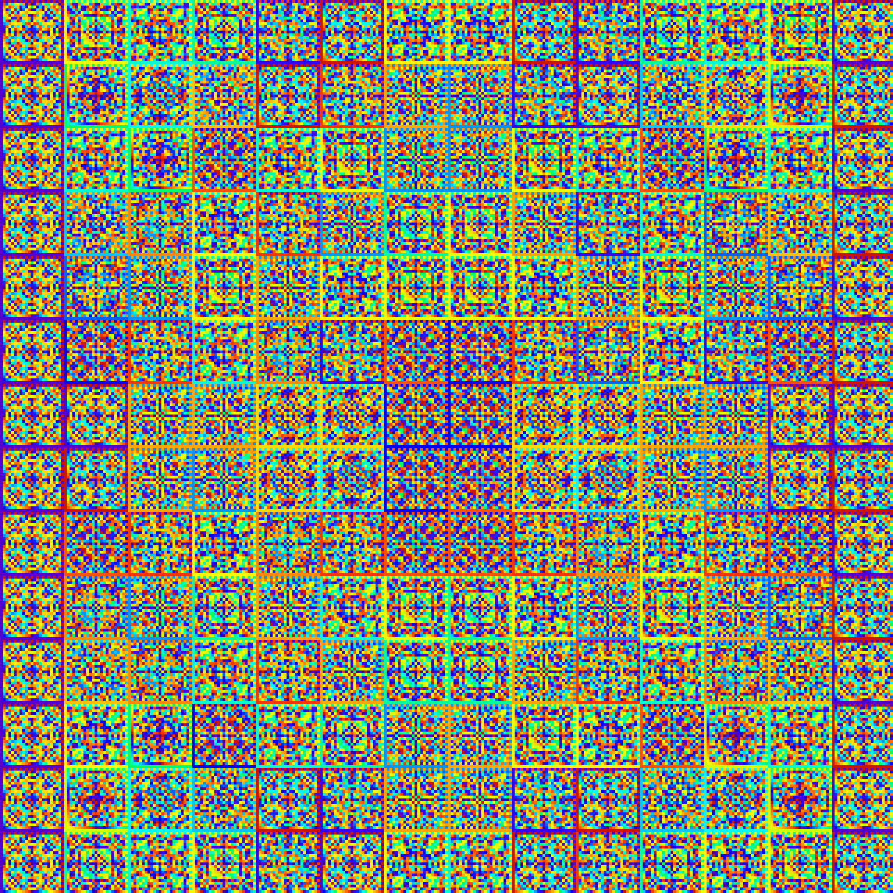

# About

I am a Master’s student in mathematics at Stockholm University, working in spectral theory and quantum graphs, with a particular interest in the interaction between topology and operator theory.

My publications of any kind can be found .

## Interests

### Quantum Graphs and Topology Change

As a Master’s student, I worked under the supervision of [Pavel Kurasov](https://staff.math.su.se/kurasov/). The result of this work is my master thesis “Berry's Phase for Quantum Graphs”.

In my Master’s thesis, I studied topology change on a figure-eight metric graph via parameter-dependent vertex conditions. The goal was to understand how changes in connectivity affect spectral properties of the Laplacian.

In particular, we showed that a full cycle of topology change induces a nontrivial Berry phase \\(\pi\\) for real-valued eigenfunctions. This demonstrates a direct link between topology change and geometric phase in quantum graph models.

{{}}

The model is based on the condition
\\[
    i (S_{\theta} - I) \overrightarrow{\psi} = (S_{\theta} + I) \partial \overrightarrow{\psi}. 
\\]

This induces topology change, illustrated below.

{{}}

As a result, we obtain a Berry phase
\\[
    \psi^{(2 \pi)} = e^{i \pi} \psi^{(0)}.
\\]

This suggests that topology change in quantum graphs has observable geometric effects and may be relevant for models of quantum systems with varying connectivity.

### Coding Theory and Krawtchouk Polynomials

During my Bachelor's studies, I worked under supervision of [Nikita Gogin](https://www.mathnet.ru/php/person.phtml?option_lang=eng&personid=45587) on Krawtchouk matrices which were used in several interesting applications.
{{}}

One of the applications was the derivation of new formulae for Bernstein and Chebyshev polynomials. Also we developed an algorithm for computing Bernstein polynomials.

Also, we studied connections of discrete functions, Krawtchouk polynomials, finite geometries, and primality.

I have two repositories on Github related to this mathematical object: [MWViewer](https://github.com/supxinfy/MWViewer) (which I used on [PCA2023](https://pca-pdmi.ru/2023/)), [krview](https://github.com/supxinfy/krview) (small program in Zig I made for fun).

In addition, I’m a [contributor](#oeis-contributions) to the OEIS (Online Encyclopedia of Integer Sequences).

Most of my contributions are involved with the de Koninck problem which is an unsolved problem in number theory.

You can find my resume .

## Education

- (2023-Present) [Stockholm University](https://www.su.se) / [KTH Royal Institute of Technology](https://www.kth.se), master's degree in mathematics.
- (2019-2023) [Petrozavodsk State University](http://petrsu.ru), bachelor's degree in Mathematics.

## Publications

1. Vladislav Shubin. “Investigation of ϕ-radical numbers”. In: *73rd Scientific Conference of Sudents and Young Scientist. Petrozavodsk*, Russia, 2021. 

2. Vladislav Shubin and Nikita Gogin. [“Bernstein Polynomials and MacWilliams transform”](https://pca-pdmi.ru/2023/files/17/Gogin-Shubin-2023.pdf). In: *International Conference Polynomial Computer Algebra* ’2023’ (PCA’2023). Saint-Petersburg, Russia, 2023. 

3. Vladislav Shubin and Nikita Gogin. [“Binomial Coefficients as Functions of their Denominator; Another Primality Criteria for Natural Integers”](https://pca-pdmi.ru/2024/files/48/prime.pdf). In: *International Conference Polynomial Computer Algebra* ’2024’ (PCA’2024). Saint-Petersburg, Russia, 2024. 

4. Vladislav Shubin and Nikita Gogin. [“Prime Power Conjecture for Projective Planes”](https://pca.conf-pdmi.ru/2025/files/63/GoginShubin.pdf). In: *International Conference Polynomial Computer Algebra* ’2025’ (PCA’2025). Saint-Petersburg, Russia, 2025. 
### OEIS contributions 

I authored the following OEIS sequences: 
[A355045](https://oeis.org/A355045), [A355059](https://oeis.org/A355059), [A337775](https://oeis.org/A337775), [A337776](https://oeis.org/A337776).

and also contributed to:
[A000108](https://oeis.org/A000108)
