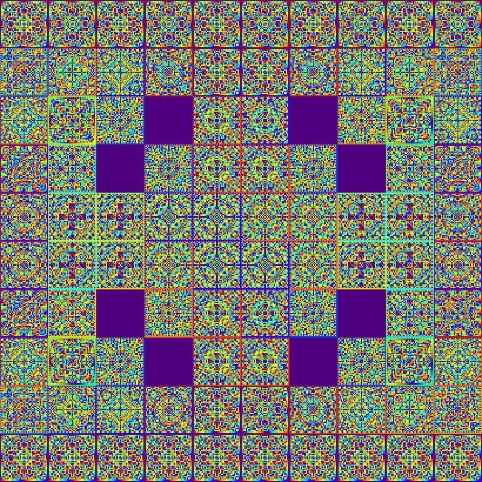

# About

I’m Vladislav Shubin, a master's student in mathematics at Stockholm University. I’m interested in math, mainly number theory and algebra.

I would like to learn a lot about Langlands program, as I love L-function and modular forms.

Also, I have a bit of an interest in [Krawtchouk polynomials](https://en.wikipedia.org/wiki/Kravchuk_polynomials) and [matrices](https://en.wikipedia.org/wiki/Krawtchouk_matrices). I have some sort of bank of hypotheses and several solved problems there.

By the way, enjoy a picture of a Krawtchouk matrix.
{{}}

If you're hooked, there's a [repository](https://github.com/supxinfy/MWViewer) on Github where I'll collect some tools to visualize Krawtchouk matrices.

The [research section](#research-stuff) currently contains some published materials on the subjects mentioned.

In addition, I’m a [contributor](#oeis-contributions) to the OEIS (Online Encyclopedia of Integer Sequences).

Most of my contributions are involved with the problem of de Koninck. The problem lies mainly in elementary number theory.

Briefly, if we have a multiplicative function \\(\\mathrm{rad}(n)\\), which is equal to the product of distinct prime of integer \\(n\\), then when is it equal to another multiplicative function of \\(n\\)?

You can find my resume .

Below, you can find some information from the resume.

## Education

- (2023-Present) [Stockholm University](https://www.su.se), master's degree in mathematics.
- (2019-2023) [Petrozavodsk State University](http://petrsu.ru), bachelor's degree in Mathematics.

## Publications

1. Vladislav Shubin. “Investigation of ϕ-radical numbers”. In: *73rd Scientific Conference of Sudents and Young Scientist. Petrozavodsk*, Russia, 2021. 

2. Vladislav Shubin and Nikita Gogin. [“Bernstein Polynomials and MacWilliams transform”](https://pca-pdmi.ru/2023/files/17/Gogin-Shubin-2023.pdf). In: *International Conference Polynomial Computer Algebra* ’2023’ (PCA’2023). Saint-Petersburg, Russia, 2023. 

3. Vladislav Shubin and Nikita Gogin. [“Binomial Coefficients as Functions of their Denominator; Another Primality Criteria for Natural Integers”](https://pca-pdmi.ru/2024/files/48/prime.pdf). In: *International Conference Polynomial Computer Algebra* ’2024’ (PCA’2024). Saint-Petersburg, Russia, 2024. 
### OEIS contributions 

I authored the following OEIS sequences: 
[A355045](https://oeis.org/A355045), [A355059](https://oeis.org/A355059), [A337775](https://oeis.org/A337775), [A337776](https://oeis.org/A337776).

and also contributed to:
[A000108](https://oeis.org/A000108)
